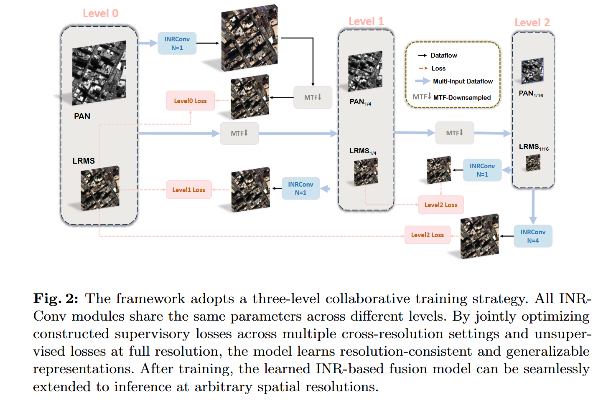
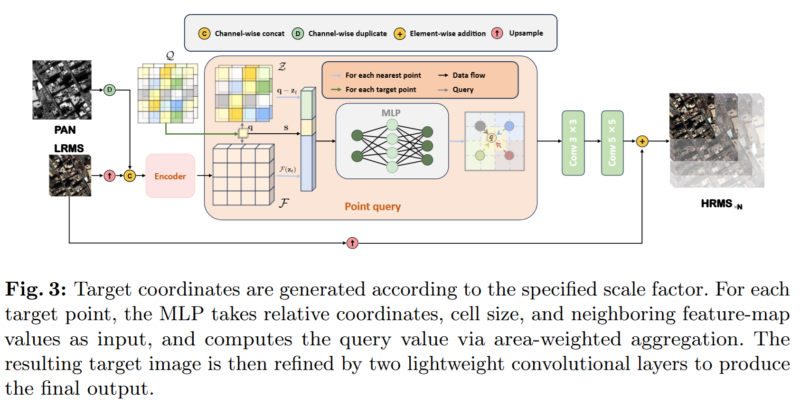

# 🚀 [ECCV 2026] G-ZAP: A Generalizable Zero-Shot Framework for Arbitrary-Scale Pansharpening

📄 [Paper](https://arxiv.org/pdf/2603.14412)

## ✨ Abstract

Pansharpening aims to fuse a high-resolution panchromatic (PAN) image and a low-resolution multispectral (LRMS) image to produce a high-resolution multispectral (HRMS) image. Recent deep models have achieved strong performance, yet they typically rely on large-scale pretraining and often generalize poorly to unseen real-world image pairs. Prior zero-shot approaches improve real-scene generalization but require per-image optimization, hindering weight reuse, and the above methods are usually limited to a fixed scale. To address this issue, we propose G-ZAP, a generalizable zero-shot framework for arbitrary-scale pansharpening, designed to handle cross-resolution, cross-scene, and cross-sensor generalization. G-ZAP adopts a feature-based implicit neural representation (INR) fusion network as the backbone and introduces a multi-scale, semi-supervised training scheme to enable robust generalization. Extensive experiments on multiple real-world datasets show that G-ZAP achieves state-of-the-art results under PAN-scale fusion in both visual quality and quantitative metrics. Notably, G-ZAP supports weight reuse across image pairs while maintaining competitiveness with per-pair retraining, demonstrating strong potential for efficient real-world deployment.

## 📰 News

- 🎉 **2026/07**: Code released.
- 🏆 **2026/06**: G-ZAP has been accepted by **ECCV 2026**.
- 📚 **2026/03**: The paper is available on arXiv.

## 🔍 Quick Overview

This repository contains the official implementation of **G-ZAP** for zero-shot and arbitrary-scale pansharpening.

- 🛰️ `train.py` / `test.py`: 8-band setting, e.g. WV3/WV2.
- 🌍 `train_band4.py` / `test_band4.py`: 4-band setting, e.g. GF2/QB.
- 🧠 `models/model_INR.py`: INRConv backbone for 8-band pansharpening.
- 🧩 `models/model_INR_band4.py`: INRConv backbone for 4-band pansharpening.
- ⚙️ `wald_utilities.py` and `loss.py`: Wald degradation and spectral consistency loss.

The main framework and INRConv module illustrations are included in this repository:

### 🧭 Overall Framework



### 🧠 INRConv Module



## 🛠️ Installation

```bash
conda create -n gzap python=3.8
conda activate gzap
pip install -r requirements.txt
```

💡 The PyTorch/CUDA build should match your local GPU environment. The experiments in the paper use an NVIDIA RTX 3090 GPU.

## 📦 Dataset

The experiments use real-world pansharpening datasets from [PanCollection](https://github.com/liangjiandeng/PanCollection), including WV3, GF2, and WV2. The expected HDF5 keys are:

- `pan`: high-resolution panchromatic image
- `ms`: low-resolution multispectral image
- `lms`: upsampled multispectral image
- `gt` or `GT`: optional reference image, when available

## 🏋️ Training

### 🛰️ 8-Band Setting

```bash
python train.py \
  --path data/test_wv3_OrigScale_multiExm1.h5 \
  --sensor WV3 \
  --id 0 \
  --num_images -1 \
  --epochs 500 \
  --lr 0.0005 \
  --save_dir results_mat
```

### 🌍 4-Band Setting

```bash
python train_band4.py \
  --path data/test_gf2_OrigScale_multiExm1.h5 \
  --sensor GF2 \
  --id 0 \
  --num_images -1 \
  --epochs 500 \
  --lr 0.0005 \
  --save_dir results_band4_mat
```

💾 The scripts save the best per-image weights to `temp_weights/` or `temp_weights_band4/`.

## 🧪 Inference

### 🛰️ 8-Band Setting

```bash
python test.py \
  --path data/test_wv3_OrigScale_multiExm1.h5 \
  --sensor WV3 \
  --start_id 0 \
  --num 20 \
  --eval_scale 1 \
  --save_pth_name temp_weights/temp_best_model_id0.pth \
  --save_dir test_results_mat
```

### 🌍 4-Band Setting

```bash
python test_band4.py \
  --path data/test_gf2_OrigScale_multiExm1.h5 \
  --sensor GF2 \
  --start_id 0 \
  --num 20 \
  --eval_scale 1 \
  --save_pth_name temp_weights_band4/temp_best_model_id0.pth \
  --save_dir test_band4_results_mat
```

🔭 For arbitrary-scale inference, change the scale argument, for example `--eval_scale 2` for either `test.py` or `test_band4.py`.


## 📊 Results

G-ZAP is evaluated on GF2, WV3, and WV2 full-resolution benchmarks with no-reference metrics including HQNR, `D_s`, and `D_lambda`. The paper reports state-of-the-art visual and quantitative performance under both per-image zero-shot optimization and weight-reuse evaluation.

